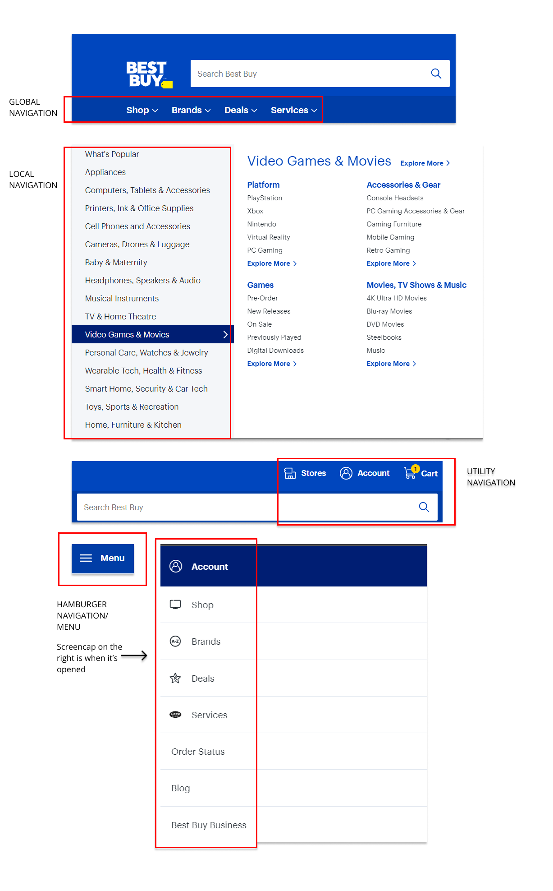

# Ed Adeagbo DSGN270 Convention Treasure Hunt

## Part 1. Navigation Breakdown

## Part 2. Hero Section Critique
The website I chose for this portion of the assignment is Roblox. It's target audience is kids and gamers. It is a website where people can play a variety of games and design their own games and characters.
### Call to Action Critique
The actions the website is asking users to perform are to either Login or Sign Up or even download it on a console. I believe it is an effective CTA as just below the big title of the page is a "SIGN UP AND START HAVING FUN" statement that uses great typography as it is in all caps and bold white lettering and a large font size. 

The sign up and log in buttons have a good contrast to the rest of the page as they are in white boxes with black lettering white the main box on the page is black with grey and white accents. In the background behind the sign up box there are multiple vibrant images in boxes spanning the whole screen which displays the many things that can be done in the site which would be very intriguing to it's new users. With the background being very colourful and the sign up box being darker I believe that engages users and makes them want to sign up.
